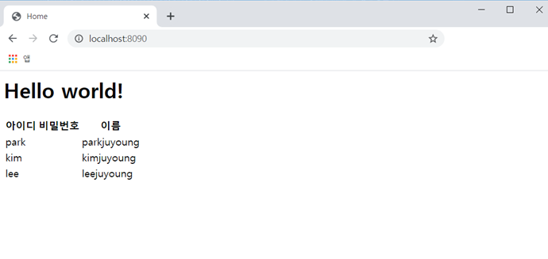
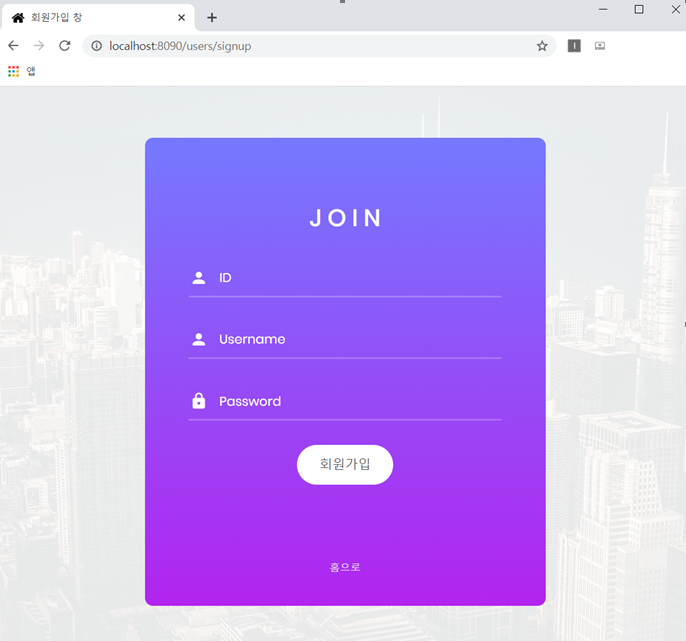

### ❗1일차 ~ 2일차

#### ❗1일차

1. 환경 세팅
    - 이클립스 설치하기 -> [설치](https://www.notion.so/1-JAVA-018d0f3a62a443aaa09b5c37832cdc69)
    - mysql 설치하기
    - spring (market에서 설치)
    - tomcat 설치하기

2. maven 연동하기
    - [MAVEN 설치/연동하는 방법](https://www.notion.so/2-Maven-6b1c937c88d640969960bcf5b03e091a)

3. Spring MVC Project 생성하기
    - [Spring MVC Project 생성하기]()

4. 톰캣 서버 연동하기
    - [톰캣 서버 연동하기]()

5. 간단한 웹 페이지 구성 (home.jsp)

-------------
#### ❗2일차

1. MySQL, MyBatis 연동하기

2. MySQL DB 조회 및 삽입 구현

3. Signup page와 Login page 구현

------

#### **examples**
 

